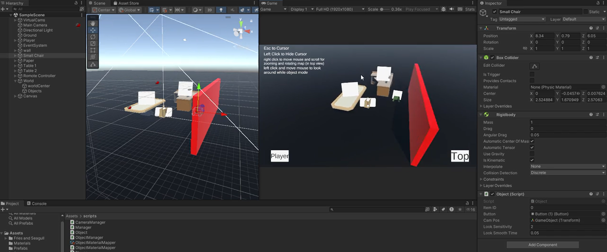

# SampleRoom Prototype

Unity prototype for exploring a room, switching camera modes, selecting objects, and previewing object material variants.

## 🎥 Gameplay Demo

## What this project does

This prototype combines:
- A free-look first-person style player controller.
- A top view camera for room overview.
- Per-object focus camera mode.
- Material cycling for selected objects.
- UI-driven camera and material controls.

Primary gameplay scripts are in `Assets/scripts`.

## Core game logic architecture

### 1) Central state controller (`Manager`)

`Manager` is the global coordinator (singleton) and controls camera mode state:
- Stores the current camera state as `VirtualCam` (`PlayerCam`, `TopCam`, `ObjectCam`).
- Exposes `OnStateChanged` event so systems react to state transitions.
- Receives object selection (`ItemClicked`) and forwards material change requests to `ObjectManager`.
- Activates the requested Cinemachine virtual camera by changing camera priorities.

This is the "hub" that connects UI, camera switching, object focus, and material changes.

### 2) Camera system (`CameraManager` + Cinemachine virtual cameras)

`CameraManager` registers the virtual camera list with `Manager` on startup.

Top-view behavior:
- Right mouse drag rotates around the room target.
- Mouse wheel zoom adjusts top camera field-of-view with smooth lerp.

Camera switch behavior is centralized in `Manager.SetVirtualCam(...)`:
- All virtual camera priorities reset to 0.
- Requested camera priority set to 1.
- If entering `ObjectCam`, camera `Follow` and `LookAt` are set to the selected object's camera anchor (`camPos` transform).

### 3) Player movement and look (`Player`)

`Player` supports:
- WASD movement with smooth damping.
- Mouse look with clamped pitch.
- Fixed Y-position to prevent vertical drift.

Movement is only enabled in `PlayerCam`:
- On `PlayerCam`: player movement enabled, cursor hidden.
- On other modes: movement disabled, cursor shown.

Other input:
- `Q` quits the application.
- `Esc` reveals cursor.
- Left click hides cursor (while movement is enabled).

### 4) Object interaction (`Object`)

Each interactive object has:
- `itemID` used for material lookup.
- A UI `Button` used as a clickable hotspot.
- A `camPos` transform used as object-focus camera anchor.

Interaction flow:
1. User clicks object button.
2. Object asks `Manager` to switch to `ObjectCam` and marks itself as selected (`ItemClicked(this)`).
3. Object camera anchor smoothly rotates to look at the object.
4. While in object mode and holding left mouse, player can orbit/adjust view around the object by rotating `camPos`.

Object also reacts to camera state changes:
- In `PlayerCam`, interaction button is disabled.
- In non-player modes, interaction button becomes active (with delay helper).

### 5) Material system (`ObjectManager` + `ObjectMaterialMapper`)

Material data source:
- `ObjectMaterialMapper` is a `ScriptableObject` mapping `ItemID -> List<Material>`.

Runtime behavior:
- On entering `ObjectCam`, current material index resets to 0.
- UI next/previous buttons call `Manager.SetItemMaterial(indexDelta)`.
- `ObjectManager` wraps index circularly and applies the material to currently selected object.
- `Object.ApplyMaterial` sets material on the child renderer.

## UI behavior (`UIController`)

`UIController` wires buttons to state/actions:
- Player view button -> `PlayerCam`
- Top view button -> `TopCam`
- Next/Previous material buttons -> cycle selected object's materials

State-driven UI:
- Material panel visible only in `ObjectCam`.
- Minimap visible only in `PlayerCam`.

## Scene and data setup expectations

For the prototype to work correctly, ensure:
- `Manager` exists in scene and references:
  - `CameraManager`
  - `ObjectManager`
  - `ObjectMaterialMapper`
- `CameraManager` has `camList` configured with all `VirtualCam` entries.
- Objects use `Object` component with:
  - unique `itemID`
  - valid hotspot `Button`
  - valid `camPos` transform
- `ObjectMaterialMapper` asset contains entries matching object `itemID` values.
- UI buttons and panels are assigned in `UIController`.

Main scene currently present:
- `Assets/Scenes/SampleScene.unity`

## Controls

- `W / A / S / D`: move (in player mode)
- Mouse move: look around (in player mode)
- Right mouse drag: rotate top camera
- Mouse wheel: zoom top camera
- Left mouse (hold in object mode): adjust object camera orientation
- `Esc`: show cursor
- `Q`: quit app

## Script map

Primary gameplay scripts:
- `Assets/scripts/Manager.cs`
- `Assets/scripts/CameraManager.cs`
- `Assets/scripts/Player.cs`
- `Assets/scripts/Object.cs`
- `Assets/scripts/ObjectManager.cs`
- `Assets/scripts/ObjectMaterialMapper.cs`
- `Assets/scripts/UIController.cs`

